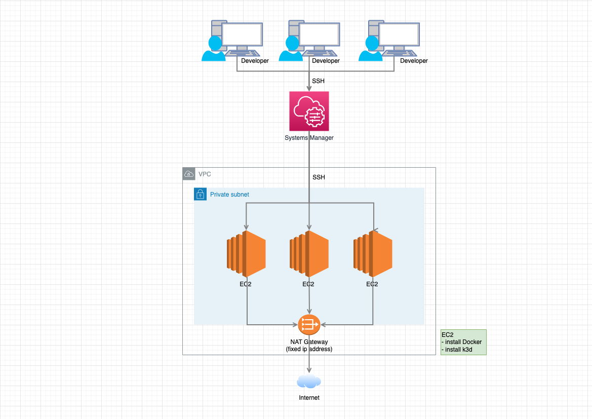
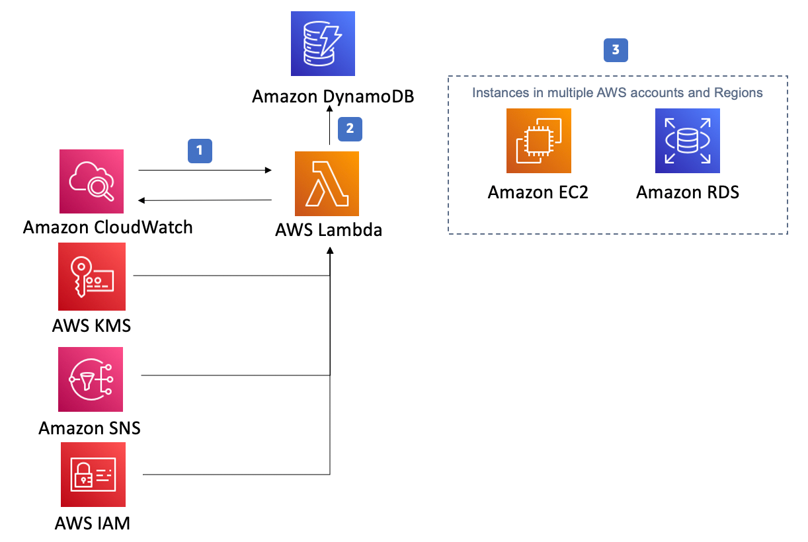
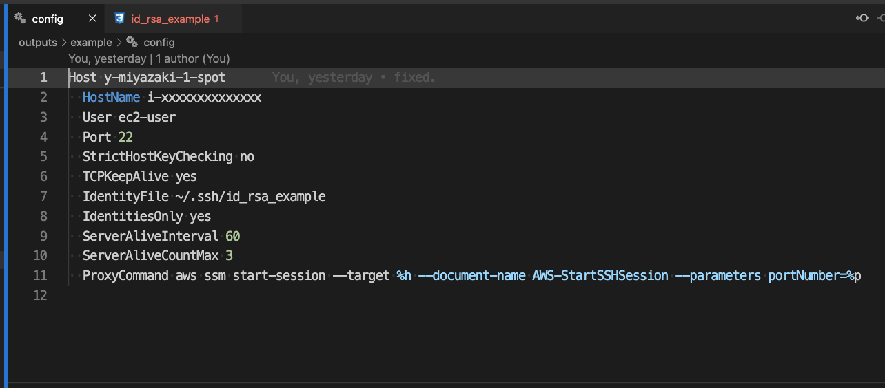
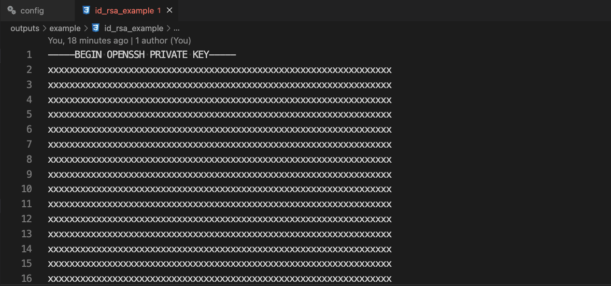

# VScode remote container on AWS EC2

# OverView

When building a Docker environment, some local PC environments consume a considerable amount of CPU/Memory, making it difficult to operate. In addition, problems such as inoperability may also occur due to the characteristics of the user's local PC environment.
This repository was created to solve these problems by making the development environment on EC2 so that it does not depend on the user's PC specs and environment as much as possible.

You can easily increase or decrease the number of EC2s provided to developers dynamically with Terraform to provide a development environment.
Although it is possible to develop by connecting to the EC2 as it is via SSH, we will use the VSCode Remote Container feature to build a container on the EC2 for development.

Basically, it is designed to be turned on and off for each setting and function by simply modifying terraform.example.tfvars in each function. Please check the link below for an explanation.

[terraform/terraform.example.tfvars](./terraform/terraform.example.tfvars)  
Document: [README-tfvars.md](./README-tfvars.md)

# INDEX

- [Features](#features)
- [For Infrastructure engineer](#for-Infrastructure-engineer)

  - [Required](#requiredinfrastructure-engineer)
  - [Not Required](#not-requiredinfrastructure-engineer)
  - [Architecture](#architecture)
  - [Architecture for Instance Scheduler](#architecture-for-instance-scheduler)
  - [Terraform Outputs](#terraform-outputs)
  - [Trouble](#trouble)

- [For developers](#for-developers)
  - [Required](#requireddeveloper)
  - [Install Docker](#install-docker)
  - [Install AWS CLI](#install-aws-cli)
  - [Install AWS Systems Manager Plugin](#install-aws-systems-manager-plugin)
  - [Set SSH configuration](#set-ssh-configuration)
  - [Docker context configuration](#docker-context-configuration)

# Features

- The number of EC2 instances can be easily increased or decreased.
- EC2 instances can be configured to distinguish between On-Demand and Spot.
- Support for secure SSH access via AWS Systems Manager.
- Initial Docker and k3d installation configuration on EC2.
- Support for starting and stopping EC2 instances with Instance Scheduler  
  Spot Instances are not supported, however, because EC2 Tags cannot be easily assigned.
- Fixed IP address for external requests by Nat Gateway.
- Automatic output of SSH configuration files distributed to Developer.

# For Infrastructure engineer

## Required(Infrastructure engineer)

- Terraform  
  https://www.terraform.io/
- AWS CLI  
  https://docs.aws.amazon.com/cli/latest/userguide/getting-started-install.html

## Not Required(Infrastructure engineer)

When using Instance Scheduler to schedule EC2, the following information is also useful.

- Python
  https://www.python.org/downloads/
- Scheduler CLI  
  https://docs.aws.amazon.com/solutions/latest/instance-scheduler-on-aws/scheduler-cli.html#install

## Architecture

To access EC2, use Remote Container in Visual Studio Code and access via AWS Systems Manager.  
Because EC2 is built within a Private Subnet, you cannot access EC2 directly. Also, because it is accessed via AWS Systems Manager, there is no Bastion server.  
All access to the outside world is via NAT Gateway. Therefore, a fixed IP address is set.



## Architecture for Instance Scheduler

The Instance Scheduler architecture is also reproduced below. It can control the start and stop of EC2 instances.


https://aws.amazon.com/solutions/implementations/instance-scheduler/?nc1=h_ls

## Terraform Outputs

After applying terraform, a configuration file for each user is automatically created in the outputs directory.
Below is a link to an example directory when created. All of these files are for developers.

[outputs/example](outputs/example)

## Instance Scheduler

The Instance Scheduler on AWS solution helps you control your AWS resource cost by configuring start and stop schedules for your Amazon Elastic Compute Cloud (Amazon EC2) and Amazon Relational Database Service (Amazon RDS) instances.

## Trouble

If you build a spot instance and run terraform apply, the Output may fail. The failure is probably because the instance_id has not yet been generated, or the Spot instance construction itself may fail.

If such a problem occurs, performing terraform apply again may resolve the problem. However, please note that Spot instances may fail to build due to pricing conditions.

```
│ Error: Missing map element
│
│   on ../modules/aws/recipes/settings/main.tf line 21, in resource "null_resource" "this":
│   21:   HostName ${self.triggers.instance_id}
│     ├────────────────
│     │ self.triggers is map of string with 2 elements
│
│ This map does not have an element with the key "instance_id".
```

# For developers

After applying terraform, a readme.txt file for each user is automatically created in the outputs directory. The contents of the readme.txt file will contain the following information.

[outputs/example/readme.txt](outputs/example/readme.txt)

## Required(Developer)

- Docker  
  https://docs.docker.com/get-docker/
  https://github.com/lima-vm/lima
- Visual Studio Code  
  https://code.visualstudio.com/
- AWS CLI  
  https://docs.aws.amazon.com/cli/latest/userguide/getting-started-install.html
- AWS Systems Manager Plugin  
  https://docs.aws.amazon.com/systems-manager/latest/userguide/session-manager-working-with-install-plugin.html

### Install Docker

_Skip this section if you already have Docker installed on your local PC._

Since it is EC2 that actually runs the Container, it does not matter which one as long as there is a docker cli.

### Install AWS CLI

_Skip this section if you already have AWS CLI installed on your local PC._

Install the AWS CLI on your local PC from the link below.  
https://docs.aws.amazon.com/cli/latest/userguide/getting-started-install.html

### Install AWS Systems Manager Plugin

_Skip this section if you already have AWS Systems Manager Plugin installed on your local PC._

Install the AWS Systems Manager Plugin on your local PC from the link below.  
https://docs.aws.amazon.com/systems-manager/latest/userguide/session-manager-working-with-install-plugin.html

### Set SSH configuration

Run the commands as described to set up SSH and configure the Docker context.

1. add the contents of `config` to `~/.ssh/config`.
1. copy `~/.ssh/id_rsa_{username}` to `~/.ssh/`.
   
   

### Docker context configuration

1. execute the command to configure to the Docker context as follows.  
   This command will set up a connection to the Docker environment in the remote environment.
   If you want to revert to the original context, run `docker context use {yourcontext}`.

   ```
   docker context create {yourcontext} --docker "host=ssh://ec2_user@{host}"
   docker context use {yourcontext}
   docker context list
   ```

1. use Visual Studio Code Remote Container to make the connection.
